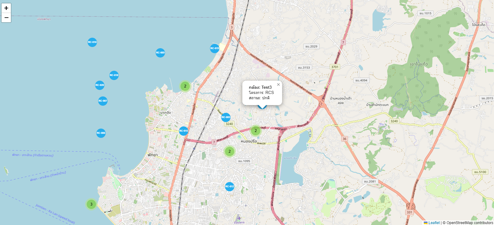

# Re-creating the README content after session reset

# 📸 CCTV Map Viewer

**CCTV Map Viewer** is a simple interactive web application that displays CCTV camera locations on a map using [Leaflet.js](https://leafletjs.com/) and [Leaflet.markercluster](https://github.com/Leaflet/Leaflet.markercluster). The project is designed to help visualize camera statuses with clustering functionality for better performance and readability.

---

## 🗺️ Demo



---

## 🚀 Getting Started

### 📦 Clone this repository

```bash
git clone https://github.com/yourusername/cctv-map-viewer.git
cd cctv-map-viewer
```
## Database
```bash
CREATE TABLE cctv_Device_info (
    id VARCHAR(10),
    cam_no INT,
    camera_name VARCHAR(80),
    Latitude VARCHAR(50),
    Longitude VARCHAR(50),
    Location VARCHAR(50),
    Leasing_code VARCHAR(10),
    Leasing_detail VARCHAR(60),
    Leasing_no VARCHAR(10),
    Brand VARCHAR(45),
    Model VARCHAR(45),
    Type VARCHAR(25),
    `Group` INT,
    `Order` INT,
    Project VARCHAR(5),
    SubPro VARCHAR(5),
    NewCode VARCHAR(10),
    `Project Name` LONGTEXT,
    TimeChecker VARCHAR(5),
    time_period_check VARCHAR(10),
    NVR VARCHAR(50),
    Contract VARCHAR(50),
    G1 VARCHAR(25),
    G2 VARCHAR(25),
    G3 VARCHAR(25),
    G4 VARCHAR(25),
    DAV VARCHAR(25),
    ANV VARCHAR(10),
    LPR VARCHAR(10),
    BCA VARCHAR(10),
    AI5 VARCHAR(10),
    OS66 VARCHAR(50),
    OS67 VARCHAR(50),
    cctv_Online_status VARCHAR(45),
    online_cause VARCHAR(45),
    online_other_cause VARCHAR(45),
    cctv_position VARCHAR(45),
    position_symptom VARCHAR(45),
    position_other_symptom LONGTEXT,
    cctv_clear VARCHAR(45),
    clear_symptom VARCHAR(45),
    clear_other_symptom LONGTEXT,
    cctv_record VARCHAR(45),
    record_symptom VARCHAR(45),
    record_other_symptom LONGTEXT,
    cctv_Overall_status VARCHAR(45),
    Remark LONGTEXT,
    `Last Update` DATETIME,
    `Update By` LONGTEXT,
    log_id VARCHAR(30),
    Image LONGTEXT,
    `Use Status` VARCHAR(45),
    Use_Status_Date DATE,
    Not_Use_date DATE,
    Label LONGTEXT,
    Offline_duration INT,
    record_symptom_start DATETIME,
    record_symptom_end DATETIME,
    date_report DATETIME,
    CHARACTER SET utf8mb4 COLLATE utf8mb4_unicode_ci
);
```

```bash
INSERT INTO cctv_Device_info (
    cam_no, camera_name, Latitude, Longitude, Location,
    Project, SubPro, NewCode, NVR, Contract,
    cctv_Online_status, online_cause, online_other_cause,
    cctv_position, position_symptom, position_other_symptom,
    cctv_clear, clear_symptom, clear_other_symptom,
    cctv_record, record_symptom, record_other_symptom,
    cctv_Overall_status, `Last Update`,
    `Use Status`, Use_Status_Date, Not_Use_date,
    Label, Offline_duration
) VALUES
(
    1, 'Test1', '12.908753', '100.855225', NULL,
    'RCS', 'RCS', 'RC-001', NULL, '-',
    'Online', '', NULL,
    'ปกติ', '', NULL,
    'ปกติ', '', NULL,
    'ปกติ', '', NULL,
    'ปกติ', '2025-04-20 20:00:00',
    'ใช้งาน', '2025-04-20', '0000-00-00',
    'Test1', 0
),
(
    2, 'Test2', '12.946922', '100.942448', NULL,
    'RCS', 'RCS', 'RC-002', NULL, '-',
    'Online', '', NULL,
    'ปกติ', '', NULL,
    'ปกติ', '', NULL,
    'ปกติ', '', NULL,
    'ปกติ', '2025-04-20 20:00:00',
    'ใช้งาน', '2025-04-20', '0000-00-00',
    'Test2', 0
);
```
